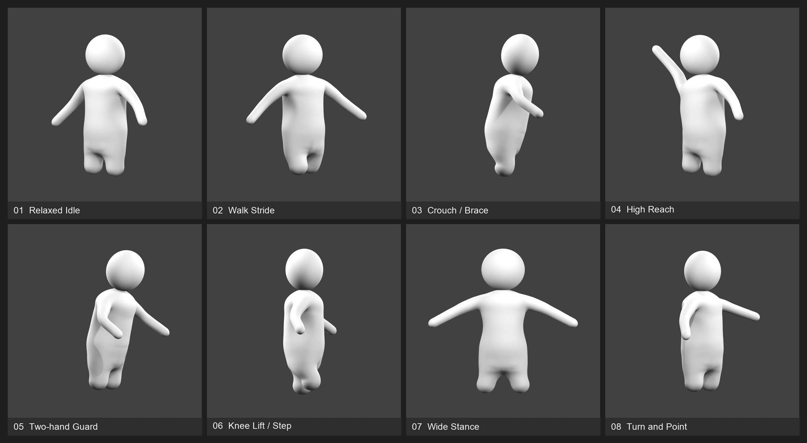

# Project Hotfix

친구 2~4명이 서로를 붙잡고 던지며 마지막까지 살아남는 3D 물리 파티 게임을 개발하고 있습니다. 한 라운드가 끝나면 패자가 다음 라운드의 규칙을 바꿉니다. 점프할 때 주변 사람이 밀려나거나, 공격을 맞힌 사람까지 뒤로 튕겨 나가는 식입니다. 이렇게 추가한 규칙을 **패치**라고 부릅니다.

Project Hotfix는 가칭입니다. 혼자 개발하고 있으며, 목표 플랫폼은 Windows PC(x64)입니다. 출시일은 정해 두지 않았습니다.

**아직 플레이 가능한 대전 빌드는 없습니다.** 이 저장소에는 기획 문서, Unity 기반 코드, Blender 캐릭터 원본과 제작 도구가 들어 있습니다. 아래 게임 설명은 구현할 규칙을 정리한 것이며, 실제로 만들어진 부분은 [현재 개발 상태](#현재-개발-상태)에서 확인할 수 있습니다.

## 어떤 게임인가요?

마우스 왼쪽과 오른쪽 버튼으로 캐릭터의 양손을 따로 조작합니다. 짧게 누르면 주먹을 뻗고, 길게 누르면 상대나 주변 물체를 붙잡습니다. 상대를 가장자리로 끌고 가서 던질 수도 있고, 떨어지는 순간 난간을 붙잡고 버틸 수도 있습니다. 공중에서는 발차기와 드롭킥을 사용할 수 있습니다.

쓰러졌다고 바로 탈락하는 것은 아닙니다. 몸을 가누지 못하는 동안 붙잡혀 끌려갈 수 있고, 같은 라운드에서 여러 번 쓰러지면 일어나는 데 더 오래 걸립니다. 최종 탈락은 맵 밖으로 떨어지거나 맵의 치명적인 장치에 당했을 때 결정됩니다.

모두가 같은 구도의 카메라로 경기를 봅니다. 화면을 가리는 정보는 줄이고 캐릭터의 움직임과 충돌에 집중하려고 합니다. 점수와 현재 패치는 필요할 때 `Tab`으로 확인합니다.

이 게임에서 만들고 싶은 장면은 단순합니다. 상대를 밀어내려고 뛰었는데 점프 패치가 발동해 엉뚱한 친구가 떨어지고, 다음 판에는 그 친구가 고른 패치 때문에 다른 일이 벌어지는 것입니다.

## 한 경기는 이렇게 진행됩니다

1. **방에 모입니다.** 방장까지 2~4명이 참가합니다. 로비에서도 캐릭터를 움직이고, 외형을 바꾸거나 친구와 놀 수 있습니다.
2. **준비되면 방장이 시작합니다.** 참가자는 준비 상태를 켜고, 모두의 접속과 외형 준비가 끝나면 방장이 시작 버튼을 누릅니다.
3. **라운드에서 살아남습니다.** 3초 카운트다운 뒤 전투가 시작됩니다. 마지막 생존자에게 1점을 줍니다.
4. **패자가 패치를 고릅니다.** 경기가 아직 끝나지 않았다면 다음 라운드부터 적용할 규칙 하나를 추가합니다.
5. **먼저 4점을 얻으면 승리합니다.** 경기가 끝나면 같은 방의 로비로 돌아가 다시 시작할 수 있습니다.

기본 라운드는 **60초**입니다. 시간이 다 됐는데 둘 이상 살아 있으면 맵의 위험이 커지는 서든 데스로 이어집니다. 다음 라운드에는 캐릭터, 무기, 맵 장치가 초기화되고 점수와 활성 패치는 유지됩니다.

## 패치: 패자가 바꾸는 다음 라운드

2인 경기에서는 그 라운드의 패자가, 3~4인 경기에서는 가장 먼저 탈락한 사람이 패치를 고릅니다. 먼저 나온 **발동 조건 두 개 중 하나**를 고른 다음, 그 조건에 맞는 **효과 두 개 중 하나**를 고르는 방식입니다. 두 번의 선택에 주어지는 시간은 합쳐서 7초입니다. 선택을 끝내지 못하면 정해진 기본 후보가 적용됩니다.

패치는 다음 라운드부터 **모든 플레이어에게 똑같이** 적용됩니다. 고른 사람도 예외가 없습니다. 최대 세 개까지 유지되며, 네 번째가 들어오면 가장 오래된 패치가 빠집니다.

첫 구현 대상으로 정한 패치는 12개입니다.

| 발동 조건 | 고를 수 있는 효과 |
|---|---|
| 점프했을 때 | 더 높이 뛰기 / 주변의 다른 플레이어 밀어내기 |
| 공격을 맞혔을 때 | 상대를 더 멀리 밀어내기 / 공격한 사람도 뒤로 밀려나기 |
| 다른 플레이어를 붙잡았을 때 | 상대를 잠시 더 쉽게 들어 던지기 / 현재 잡기를 잠시 더 강하게 유지하기 |
| 쓰러졌을 때 | 바닥에서 더 멀리 미끄러지기 / 몸이 한 번 튀어 오르기 |
| 무기가 보급될 때 | 무기 두 개를 동시에 떨어뜨리기 / 잠시 뒤 한 번 더 보급하기 |
| 무기로 공격을 맞혔을 때 | 맞은 상대가 들고 있던 무기 놓치기 / 공격한 사람이 사용한 무기 놓치기 |

예를 들어 ‘점프하면 주변 사람을 밀어낸다’가 적용되면 상대 옆에서 뛰는 것만으로 가장자리 싸움이 달라집니다. 여기에 ‘공격을 맞히면 공격자도 뒤로 밀려난다’가 더해지면, 안전하게 때릴 수 있는 위치도 다시 생각해야 합니다.

같은 발동 조건의 두 효과가 동시에 적용되지는 않습니다. 패치로 점수나 승리 조건을 바꾸지도 않습니다. 세부 조합과 수치는 [패치 설계 문서](docs/PATCH_DESIGN.md)에 정리되어 있습니다.

## 기본 조작

키보드와 마우스를 기준으로 정한 조작입니다. 아래 입력을 처리하는 실제 캐릭터 컨트롤러는 아직 개발 전입니다.

| 입력 | 행동 |
|---|---|
| `W` `A` `S` `D` | 화면 기준으로 이동. 캐릭터는 이동하는 방향으로 돌아봅니다. |
| 왼쪽 `Shift` 누르고 있기 | 달리기. 별도 스태미나 게이지는 없습니다. |
| `Space` | 점프 |
| 마우스 왼쪽 버튼 짧게 누르기 | 지상에서는 왼손 주먹, 공중에서는 왼발 차기 |
| 마우스 오른쪽 버튼 짧게 누르기 | 지상에서는 오른손 주먹, 공중에서는 오른발 차기 |
| 마우스 버튼 길게 누르기 | 해당 손으로 잡기. 버튼을 놓으면 잡기도 풉니다. |
| 공중에서 마우스 양쪽 버튼을 거의 동시에 누르기 | 드롭킥 |
| `C` | 로비에서 캐릭터 꾸미기 열기 |
| `E` | 참가자의 준비 / 준비 취소 |
| `Tab` | 경기 중 점수와 활성 패치 확인 |
| `Esc` | 로비에서는 마우스 커서 모드, 경기 중에는 메뉴 열기 |

경기 중 메뉴를 열어도 다른 플레이어와 맵 장치는 계속 움직입니다. 무기를 사용하고 내려놓는 세부 입력은 플레이 테스트를 거쳐 확정할 예정입니다.

## 무기와 맵

### 무기

무기는 라운드 도중 하늘에서 주기적으로 보급됩니다. 참가 인원에 따라 보급 간격과 동시에 놓일 수 있는 무기 수를 조정하는 설계입니다.

| 종류 | 정해 둔 사용 방식 |
|---|---|
| 권총 | 한 번 누를 때 한 발씩 발사. 총 7발이며, 한 발의 반동이 큽니다. |
| 소총 | 누르고 있는 동안 연사. 총 30발이며, 계속 쏠수록 탄이 퍼집니다. |
| 야구방망이 | 가까운 상대에게 휘두르는 근접 무기 |
| 오함마 | 건설용 큰 망치 형태의 근접 무기 |

총기는 재장전하지 않습니다. 탄을 다 쓰면 손에서 놓치고 잠시 뒤 사라집니다. 무기가 없어도 주먹, 잡기, 발차기와 맵 장치를 이용해 싸울 수 있도록 만들고 있습니다. 무기의 모델과 전투 기능은 아직 구현 전입니다.

### 첫 맵: Construction Drop

첫 맵은 공사 중인 고층 건물의 옥상입니다. 네 방향의 가장자리가 열려 있고, 아래로 떨어지더라도 외벽이나 철골을 붙잡으면 돌아올 기회가 있습니다.

중앙에는 크레인이 매단 중량물과 이를 떨어뜨리는 레버가 있습니다. 상대를 낙하 지점으로 몰아넣은 뒤 레버를 직접 붙잡아 당기는 방식입니다. 옆에서 흔들리는 크레인 갈고리는 몸을 밀쳐내므로, 맞는 위치에 따라 추락할 수 있습니다.

서든 데스에서는 외곽 발판이 기울고 기존 장치의 위험이 커집니다. 2인, 3인, 4인 모두 같은 맵을 사용하며 시작 위치의 배정과 무기 보급량을 조정합니다.

현재는 [맵 설계](docs/MAP_P00_CONSTRUCTION_DROP.md)까지 작성되어 있고, Unity에서 플레이할 맵은 아직 없습니다.

## 로비와 캐릭터 꾸미기

로비는 캐릭터를 직접 움직이며 기다리는 공간으로 계획하고 있습니다. `C`를 눌러 캐릭터에 그림을 그리거나 눈, 콧수염, 모자 같은 장식을 배치할 수 있게 할 예정입니다. 장식의 위치와 회전은 자유롭게 정하되, 외형 때문에 몸의 충돌 범위나 힘이 달라지지는 않습니다.

외형 프리셋은 PC에 최대 10개까지 저장하는 설계입니다. 친구에게는 방장이 확인한 외형 데이터를 전달합니다. 이 기능에 쓸 로컬 파일 저장 코드는 있지만, 꾸미기 화면과 프리셋 관리, 친구에게 외형을 보내는 기능은 아직 연결되지 않았습니다.

## 연결 방식과 개발 순서

방을 연 사람의 PC가 충돌, 탈락, 점수와 패치의 결과를 판정합니다. 다른 참가자는 자신의 입력을 보내고 결과를 받아 봅니다. 별도로 운영하는 게임 서버나 계정 서버는 두지 않을 계획입니다.

먼저 같은 네트워크 또는 IP 주소를 직접 지정하는 접속으로 **실제 PC 2대, 3대, 4대에서 한 경기를 끝까지 할 수 있는 상태**를 만들려고 합니다. 그다음 Steam 친구 초대와 Steam을 통한 연결을 붙입니다. 지금 저장소에 Steam 접속 기능이 들어 있는 것은 아닙니다.

개발 순서는 다음과 같습니다.

1. 캐릭터 움직임과 잡기·타격·공중 공격, 공용 카메라를 만들어 기본 싸움을 확인합니다.
2. 라운드 진행과 패치 12개, 무기 보급과 전투, 첫 맵을 연결합니다.
3. 로비에서 경기를 시작하고 다시 돌아오는 흐름을 여러 PC에서 검증합니다. 이 단계의 목표는 대표 맵 하나, 단순한 테스트 맵 두 개, 패치 20개와 최소한의 외형 꾸미기입니다.
4. 이후 Steam 연결을 통합하고, 로비·꾸미기·맵의 완성도와 콘텐츠를 늘립니다.

초기 버전은 한국어와 기본 효과음부터 작업합니다. 공개 자동 매칭, 랭크, 방장 이전 기능은 계획에 없습니다. 방장이 나가면 방도 종료됩니다.

## 현재 개발 상태

2026년 9월 3일 저장소 기준입니다.

| 영역 | 실제 상태 |
|---|---|
| 게임 기획 | 기본 전투, 패치, 무기, 첫 맵, 로비와 접속 규칙을 문서로 정리했습니다. |
| Unity 프로젝트 | 에디터·패키지 버전과 코드 모듈의 기본 구성을 잡았습니다. |
| 게임 진행 코드 | 시뮬레이션의 실행 횟수를 갱신하는 최소 코드와 테스트가 있습니다. 라운드·전투 기능은 아직 없습니다. |
| 로컬 저장 | 저장 도중 오류가 나더라도 파일 손상을 줄이기 위한 교체 저장·백업·복구 코드와 테스트가 있습니다. |
| 캐릭터 모델 | 기본 형태의 검토를 거쳐 리그와 자세에 따른 변형을 확인하고 있습니다. |
| 캐릭터의 Unity 적용 | 이전 모델을 FBX로 옮겨 형태를 비교한 코드와 자료가 있습니다. 현재 작업 중인 리그의 게임 적용은 아직입니다. |
| 입력·화면·네트워크 | 패키지와 모듈 경계만 준비되어 있습니다. 조작, 게임 화면, 실제 접속 코드는 아직 없습니다. |
| 실행 빌드 | Windows용 빌드 설정만 준비되어 있습니다. 배포할 실행 파일은 없습니다. |

아래는 Blender에서 확인한 캐릭터 자세입니다. 리그를 움직였을 때 몸이 어떻게 변하는지 살펴본 **정적 테스트 렌더**이며, 게임 화면이나 완성된 애니메이션은 아닙니다.



캐릭터의 기본 형태는 [r16 검토 기록](BlenderSource/Characters/C1B-RW-016-preview/NeutralApprovalRecord.json), 현재 리그 작업은 [r20 폴더](BlenderSource/Characters/C1B-RW-020-helper-rig-preview)에서 확인할 수 있습니다. 세부 기획·검토 문서에는 이전 작업 단계의 기록도 남아 있으므로 작성 기준일을 함께 봐 주세요.

## 프로젝트 열기

### 필요한 도구

| 도구 | 저장소 기준 버전 | 용도 |
|---|---|---|
| Unity Editor | `6000.3.9f1` — Unity 6.3 LTS | 프로젝트 열기와 C# 작업 |
| Blender | `5.2.0 LTS` | 캐릭터 원본 수정과 제작 스크립트 실행 |
| Git / Git LFS | Git LFS `3.8.0` 기준 | 저장소와 `.blend`·`.fbx` 파일 내려받기 |

Unity 패키지는 저장소의 `manifest.json`과 `packages-lock.json`에 맞춰 복원합니다. 현재 기준은 URP `17.3.0`, Input System `1.18.0`, Unity Transport `2.6.0`입니다. Blender는 모델을 수정할 때 필요합니다.

### 내려받고 Unity에서 열기

Git과 Git LFS가 설치되어 있고 비공개 저장소에 접근할 수 있는 계정으로 로그인한 상태에서 실행합니다.

```bash
git clone https://github.com/kjh4845/party-game.git
cd party-game
git lfs install --local
git lfs pull
```

Unity Hub의 프로젝트 추가 기능으로 `party-game/Project hotfix` 폴더를 선택하고, `6000.3.9f1`로 엽니다. 저장소 최상위 폴더보다 한 단계 안쪽에 Unity 프로젝트가 있습니다. 첫 실행에는 패키지 복원과 에셋 임포트 시간이 필요합니다.

현재 씬은 `Assets/Scenes/SampleScene.unity` 하나입니다. 카메라와 조명만 있는 기본 씬이므로 Play를 눌러도 게임이 시작되지는 않습니다.

### 테스트와 빌드

Unity의 **Window → General → Test Runner**에서 EditMode와 PlayMode 테스트를 실행할 수 있습니다. 현재 테스트는 모듈 의존성, 최소 시뮬레이션, 저장 코드와 이전 캐릭터의 임포트 결과를 확인합니다. 대전 기능을 검증하는 테스트는 아직 없습니다.

Windows 빌드 설정은 준비되어 있으며, 관련 절차는 [수동 빌드 안내](config/build_profiles/WINDOWS_BUILD_MANUAL.md)에 있습니다. 현재 이 설정으로 빌드해도 완성된 게임을 얻을 수 있는 단계는 아닙니다.

## 저장소 구성

| 경로 | 들어 있는 내용 |
|---|---|
| [`Project hotfix/`](Project%20hotfix/) | Unity 프로젝트. `Assets`, `Packages`, `ProjectSettings`를 함께 관리합니다. |
| [`BlenderSource/`](BlenderSource/) | 캐릭터 원본, 현재 검토 중인 리그, 제작 과정의 측정 자료 |
| [`docs/`](docs/) | 게임 규칙, 세부 설계와 구현 계획 |
| [`config/`](config/) | 도구 버전, 모델 제작 기준, 저장·빌드 설정과 에셋 출처 목록 |
| [`tools/`](tools/) | Blender 제작 스크립트와 저장소·에셋 검증 도구 |
| [`artifacts/`](artifacts/) | 검토 이미지, 이전 테스트 결과와 작업 보고서 |

이전 Blender 원본 중 일부는 다음 버전을 만드는 스크립트가 직접 참조하므로 남겨 두었습니다. 다시 만들 수 있는 오래된 비교 렌더, 중간 포즈 파일과 메시 실험 결과는 현재 파일 목록에서 정리했으며, 이전 커밋에서 확인할 수 있습니다. Unity 캐시, 개인 설정, 임시 파일과 Blender 자동 백업은 Git에 올리지 않습니다.

더 자세한 내용을 보려면 다음 문서부터 읽으면 됩니다.

- [게임 전체 기획](docs/01_PRD.md): 어떤 게임을 만들고 어디까지 구현할지
- [패치 설계](docs/PATCH_DESIGN.md): 조건·효과 조합과 적용 규칙
- [조작과 화면 흐름](docs/UI_UX_FLOW.md): 로비, 경기, 꾸미기 화면의 흐름
- [첫 맵 설계](docs/MAP_P00_CONSTRUCTION_DROP.md): 공사장 맵의 구조와 장치
- [구현 계획](docs/03_IMPLEMENTATION_PLAN.md): 작업 순서와 검증할 항목
- [문서 목록](docs/00_DOCUMENT_INDEX.md): 나머지 설계 문서 찾기

외부 패키지와 참고 자료의 출처 및 사용 범위는 [THIRD_PARTY_NOTICES.md](THIRD_PARTY_NOTICES.md)에 정리되어 있습니다.
