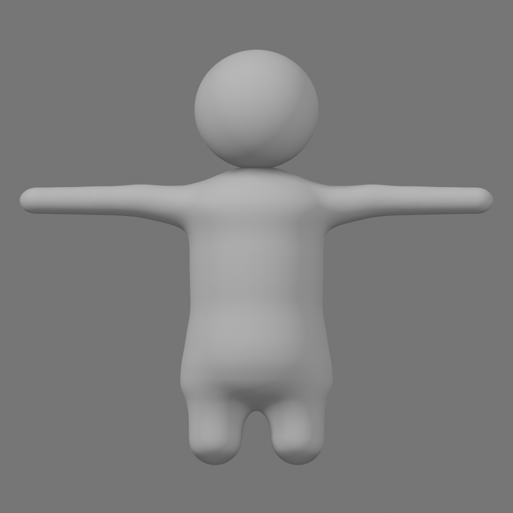
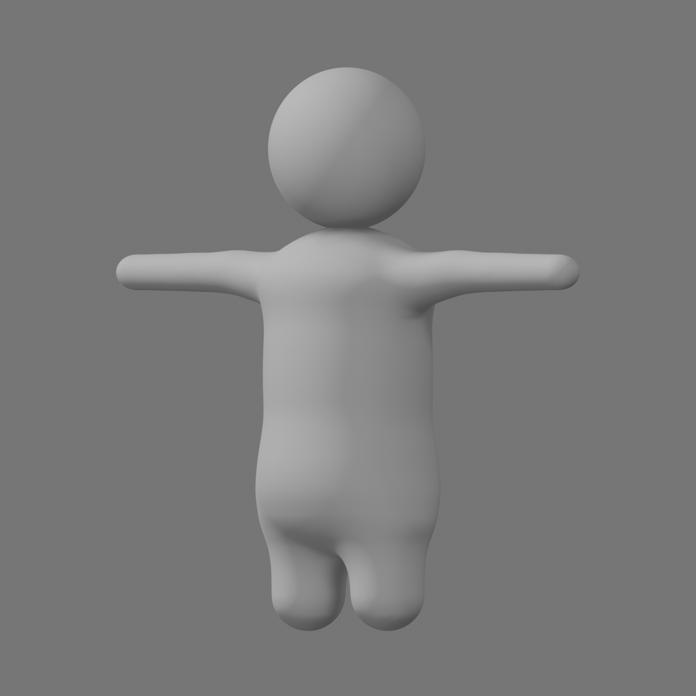
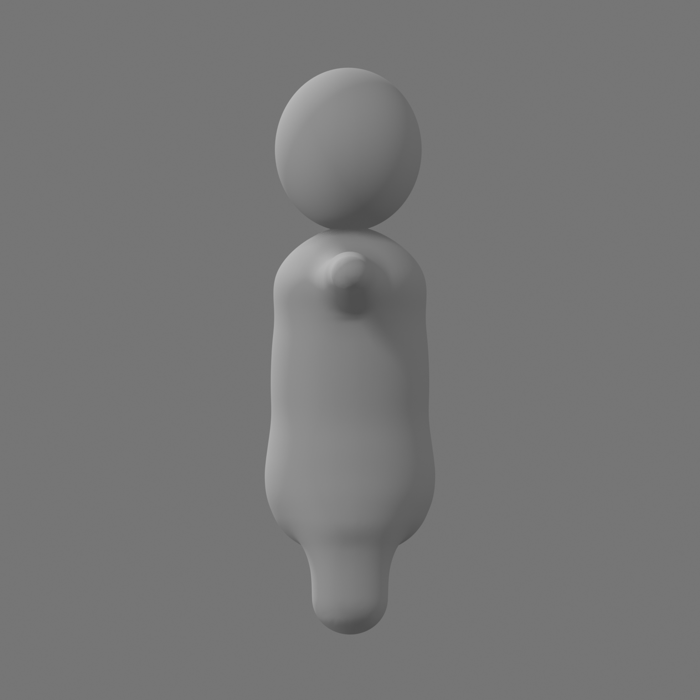
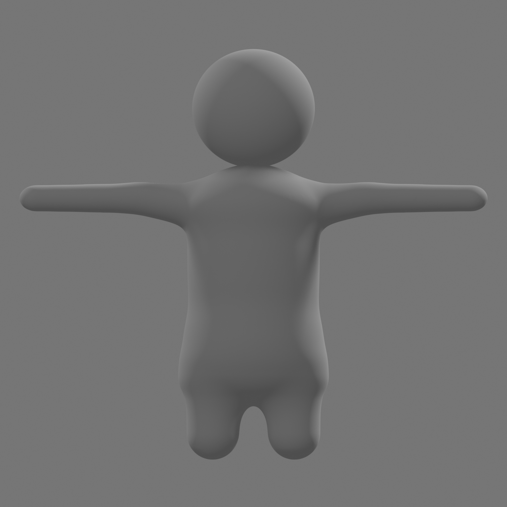

# Character Rework T-Pose Review

## 상태

| 항목 | 값 |
|---|---|
| 현재 Gate | `C1BRW-003 / UG-C1B-NEUTRAL` |
| 현재 후보 | `CHR_MasterCharacter_C1B_NeutralRework_r11` (`LOCAL_USER_REVIEW / IN_PROGRESS`) |
| 이전 r10 | 고주파 잔물결만 줄이고 몸통·어깨·복부·골반의 큰 굴곡을 그대로 남겨 사용자에게 `REJECTED / SUPERSEDED` |
| 사용자 시각 / Production topology 승인 | `false / false` |
| Rig·Pose clip·Animation·FBX·Unity·Build·Commit·push·LFS | 승인 전 `0` |

현재 사용자 확인 입력은 [r11 Blender source](../../BlenderSource/Characters/C1B-RW-011-preview/CHR_MasterCharacter_C1B_NeutralRework_r11.blend)다.
[전신 곡률 재생성·검증·렌더 스크립트](../../tools/blender/create_c1b_rw011_global_fair.py) ·
[Global fair QA report](../../BlenderSource/Characters/C1B-RW-011-preview/GlobalFairQAReport.json)

## r11에서 바꾼 부분

- r10처럼 기존 큰 굴곡을 보존한 채 미세 스무딩만 하지 않았다. 몸통 정면 폭과 측면 깊이의 저주파 profile 자체를 연속 곡선으로 다시 맞췄다.
- 정면 몸통은 짧은 간격으로 폭이 증감하던 파동을 없애고, 얕은 허리 최소점 하나 뒤 골반까지 완만하게 넓어지는 단일 흐름으로 정리했다.
- 어깨·겨드랑이에는 넓은 가중치 blend를 적용해 팔 root의 원호형 pinch를 완화하고, 전신을 `0.0045H` uniform all-quad surface로 재표본화했다.
- Body 전체에 Smooth `.20 × 30`, 체적 보존 Laplacian `.18 × 12`, Catmull-Clark `1`단계를 적용했다. 팔·다리·말단도 예외 없이 같은 전신 fairing을 통과했다.
- profile refit에서 줄어든 깊이는 Y축 `1.059334×`로 복원해 r10과 signed volume을 사실상 동일하게 유지했다. 몸통을 납작하게 줄인 후보는 폐기했다.
- X 대칭을 다시 고정하고 중복점 병합·normal 재계산 뒤 모든 modifier를 적용했다. 최종 Body는 connected component `1`, all-quad다.
- 머리는 회색 round head 하나이며 torso에 직접 닿는다. 눈·손·손가락·보이는 목은 만들지 않았다.

레퍼런스는 shape language와 비율 방향을 확인하는 시각 입력이다. T-pose 팔 길이·굵기와 수치는 이번 후보의 회귀 검사용이며 영구 제품 계약이나 gameplay reach 계약이 아니다.

## 기술 QA

| 항목 | 결과 |
|---|---:|
| Body object / connected component | `1 / 1` |
| Vertex / Edge / Face | `227942 / 455880 / 227940` |
| Triangle / Quad | `0 / 227940` |
| Runtime modifier / Armature / Action | `0 / 0 / 0` |
| Boundary / non-manifold / loose / degenerate | `0 / 0 / 0 / 0` |
| Euler characteristic / signed volume | `2 / 0.047096930773` |
| Non-adjacent BVH self-intersection | `0` |
| Adjacent angle max / `45°` hard edge / `90°` foldover | `6.843839° / 0 / 0` |
| X mirror unmatched / max deviation | `0 / 1.884956e-7H` |
| Visible arm centerline max deviation | `6.694555e-5H` |
| r10 대비 volume 변화 | `4.489624e-9%` |
| r10 대비 X / Y / Z bounds 변화 | `-0.193625% / +1.728829% / -0.100954%` |
| 정면 torso 폭 흐름 | `.341H@v.44 → .319H@v.60 → .367H@v.80` |
| Neutral / Silhouette / Rake render | `4 / 4 / 4` |
| Eyes / hands / fingers / visible neck | `0 / 0 / 0 / 0` |
| Independent visual gate | reviewer `3`, blocker `0`, `FIT_TO_SHOW` |

현재 mesh는 visual direction 확인용 uniform all-quad preview다. Manifold·mirror·BVH·fold 검증은 통과했지만 production topology 승인은 `false`이며, 사용자 시각 승인 뒤 별도 단계에서 retopology·Rig 적합성을 결정한다.

## r11 preview

| Front | Three-quarter |
|---|---|
|  |  |

| Side | Back |
|---|---|
|  |  |

## 사용자 확인 체크리스트

- [ ] 정면에서 노출된 양팔 중심선이 수평인 T-pose로 보인다.
- [ ] 정면·사선에서 어깨와 팔이 별도 cap·socket·patch 없이 한 곡면으로 이어진다.
- [ ] 겨드랑이는 깊은 구멍이나 web이 아니라 짧고 둥근 열린 공간으로 읽힌다.
- [ ] 팔 굵기가 물결치지 않고 상완에서 둥근 말단까지 부드럽게 줄어든다.
- [ ] 몸통은 bean형이고 몸통→골반→다리가 접합선 없이 이어진다.
- [ ] 몸통 정면·측면에서 짧은 간격의 폭·깊이 증감 없이 하나의 연속 곡선으로 읽힌다.
- [ ] Neutral과 단일 소프트 Rake에서 머리·어깨·팔·몸통·골반·다리에 고주파 잔물결이나 계단 음영이 없다.
- [ ] 회색 round head, 눈·손·손가락·보이는 목 `0`이 맞다.

사용자 승인 뒤에만 다음 Pose/Animation·FBX·Unity parity와 production topology 판단을 진행한다.
