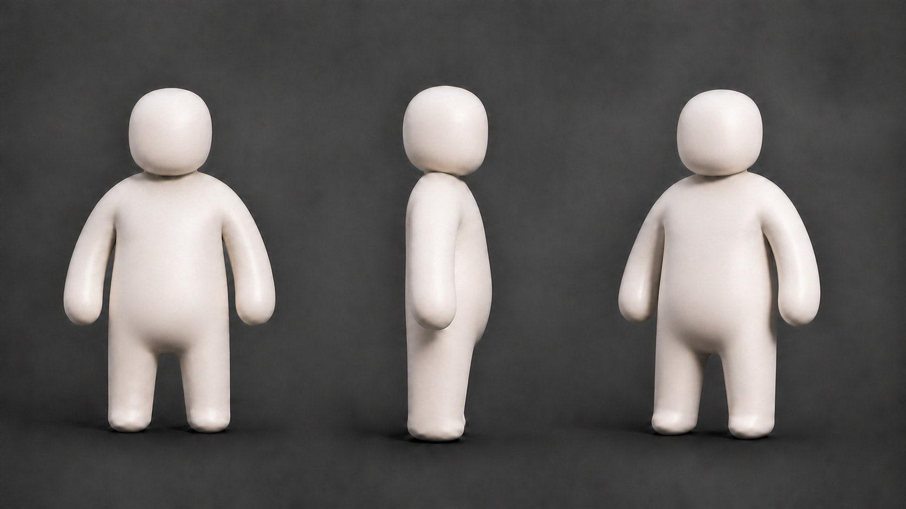
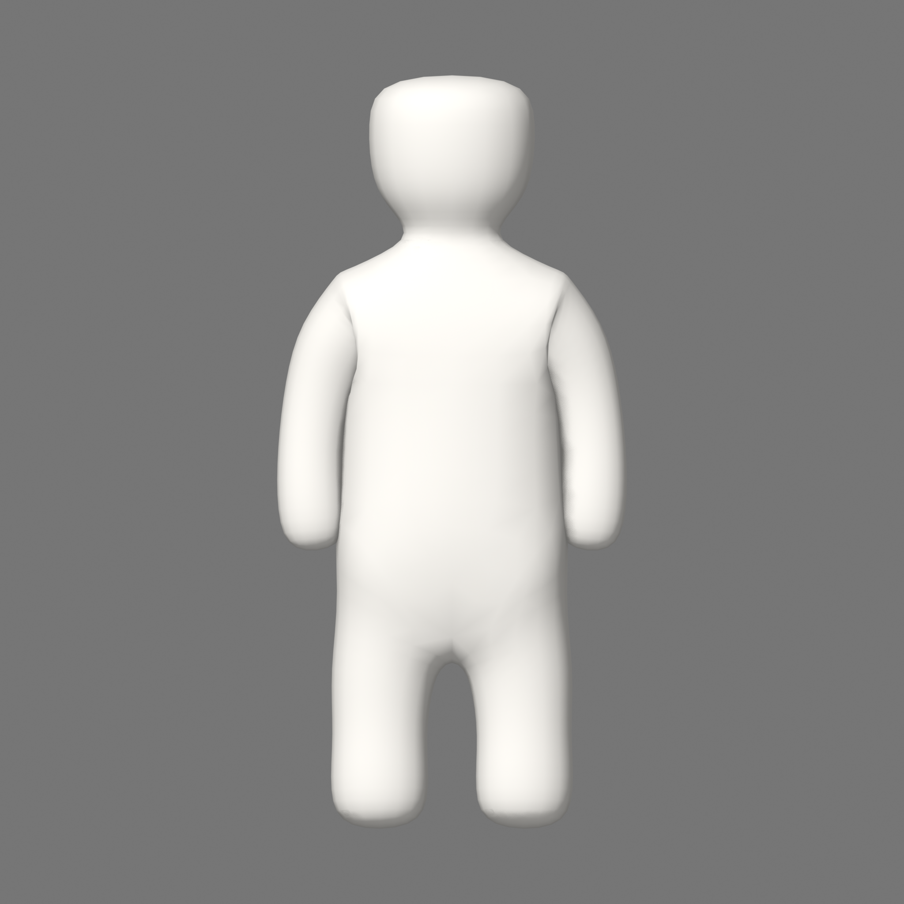
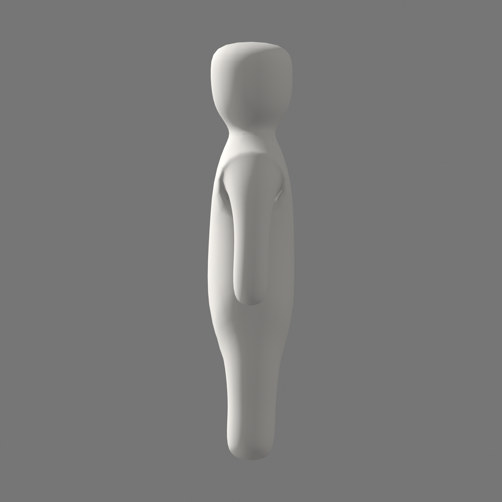
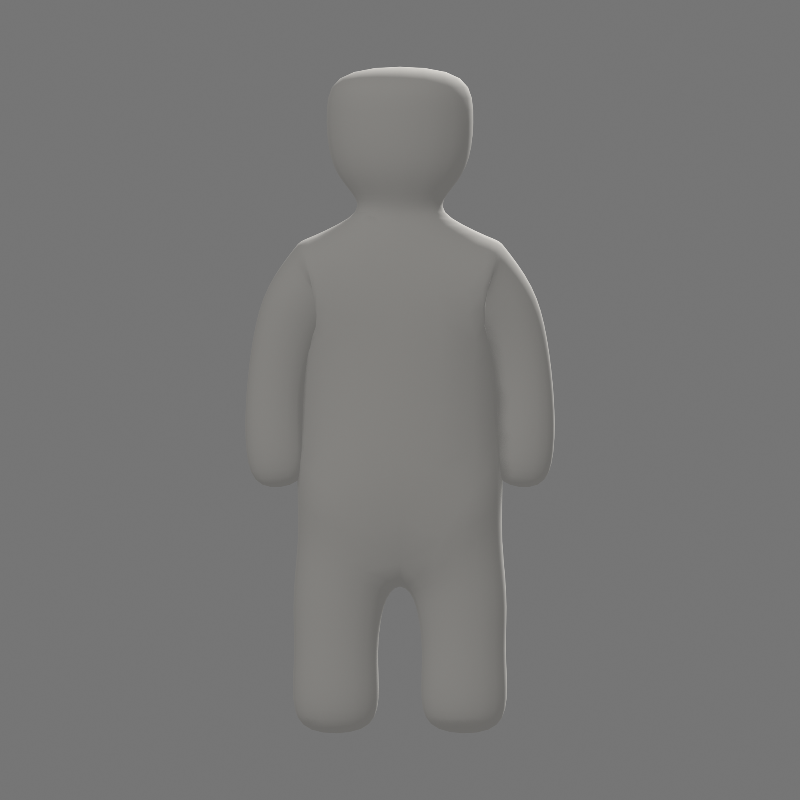
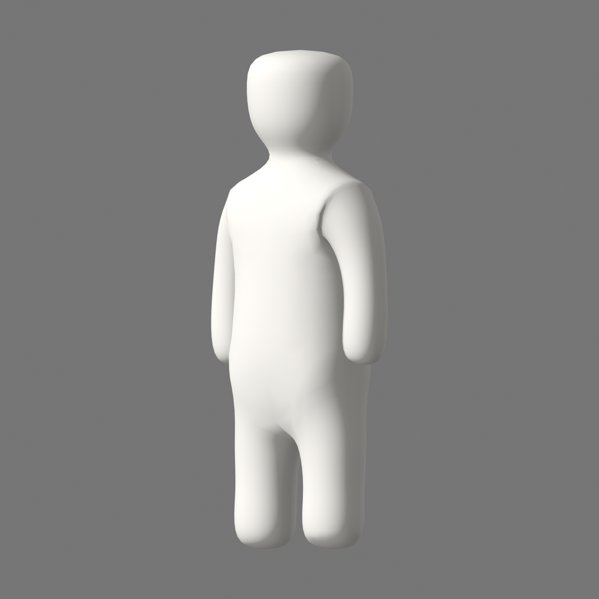

# C1B Neutral 전면 재작업 검토

## 상태

| 항목 | 값 |
|---|---|
| 작업 | `C1BRW-001..002` |
| 현재 Gate | `C1BRW-003 / UG-C1B-NEUTRAL` 사용자 검토 대기 |
| 후보 | `CHR_MasterCharacter_C1B_NeutralRework_r01` |
| 성격 | C1b 형태·연속성 검토용 START Mesh |
| 사용자 승인 | `0` |
| Pose·FBX·Unity 재반입 | 승인 전 실행 `0` |
| Production topology·UV·weight·LOD | C4 후속 |
| Player Build | 실행 `0` |

이 보고서는 기존 C1B-002..005 결과가 수치·반입에는 일치했지만 승인된 v0.13 디자인 방향과 달랐다는
사용자 지적을 반영한다. 과거 Evidence는 당시 기술 결과로 보존하되, 현재 캐릭터 승인 입력에서는 제외한다.

## 승인된 방향

형태 목표는 pixel 복제가 아니라 다음 관계다.

- 둥근 사각형 머리와 좁게 읽히는 목
- 몸통에서 자연스럽게 이어지는 둥근 어깨와 굽은 팔
- 별도 손·주먹 없이 둥글게 닫힌 forearm terminal
- 몸통·골반·U자형 가랑이에서 자연스럽게 갈라지는 짧은 양다리
- 별도 발·신발 없이 ground contact를 가진 둥근 lower-leg terminal
- 거대한 egg 몸통, 분리 peg limb, 노출된 원형 proximal cap과 배경 관통 `0`

## 새 Neutral 후보

### Front

### Side

### Back

### ThreeQuarter

## 기술 확인

| 항목 | 결과 |
|---|---:|
| Render Mesh object/datablock | `1 / 1` |
| Connected component | `1` |
| Vertex / Edge / Polygon | `1882 / 3760 / 1880` |
| Bounds H/W/D | `1.0 / 0.464322567 / 0.206985458` |
| Boundary / non-manifold / loose edge / degenerate face | `0 / 0 / 0 / 0` |
| X mirror | 필수, 자동 검증 대상 |
| Neutral/Silhouette fixed view | `4 + 4` |
| Armature / Action / Collider | `0 / 0 / 0` |
| 별도 visible hand/finger/fist/foot/shoe/toe | `0` |

Skin+Subdivision으로 생성한 graph를 적용해 하나의 닫힌 검토 Mesh로 저장했다. 이는 기존 6-part peg를
join하거나 cap으로 가린 결과가 아니다. 다만 C1b 시각 방향 검토용이며 production retopology나 skin weight
승인을 뜻하지 않는다.

## 사용자 검토 체크포인트

- [ ] 머리가 v0.13의 둥근 사각형 방향으로 읽힌다.
- [ ] 목이 과하게 길거나 머리와 몸통이 한 기둥처럼 읽히지 않는다.
- [ ] 양쪽 어깨에서 팔로 이어지는 흐름이 자연스럽다.
- [ ] 팔 끝이 평평한 원형 절단면이나 별도 손처럼 보이지 않는다.
- [ ] 몸통이 거대한 egg 또는 상자처럼 보이지 않는다.
- [ ] 골반에서 양다리가 자연스럽게 갈라지고 U자형 가랑이가 읽힌다.
- [ ] 다리 끝이 별도 발 없이 둥글게 닫혀 있다.
- [ ] 필수 view에서 cap disc, 깊은 접합 notch, 배경 관통, 뒤집힘이 보이지 않는다.

위 형태가 승인된 뒤에만 `C1BRW-004` Pose8·lineup과 `C1BRW-005` FBX/Unity parity를 다시 만든다.
