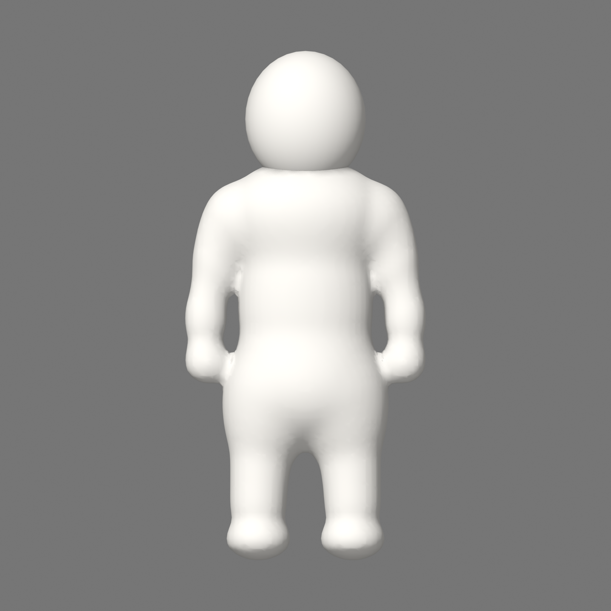
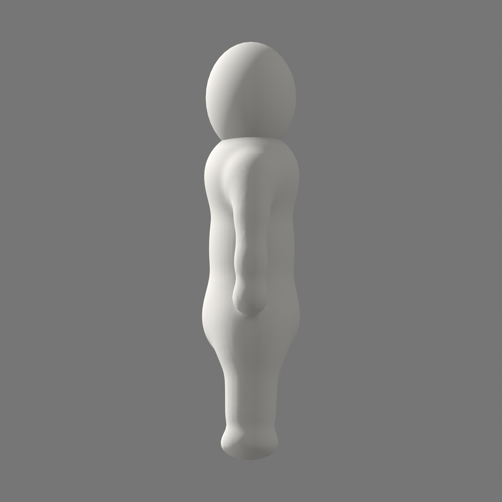
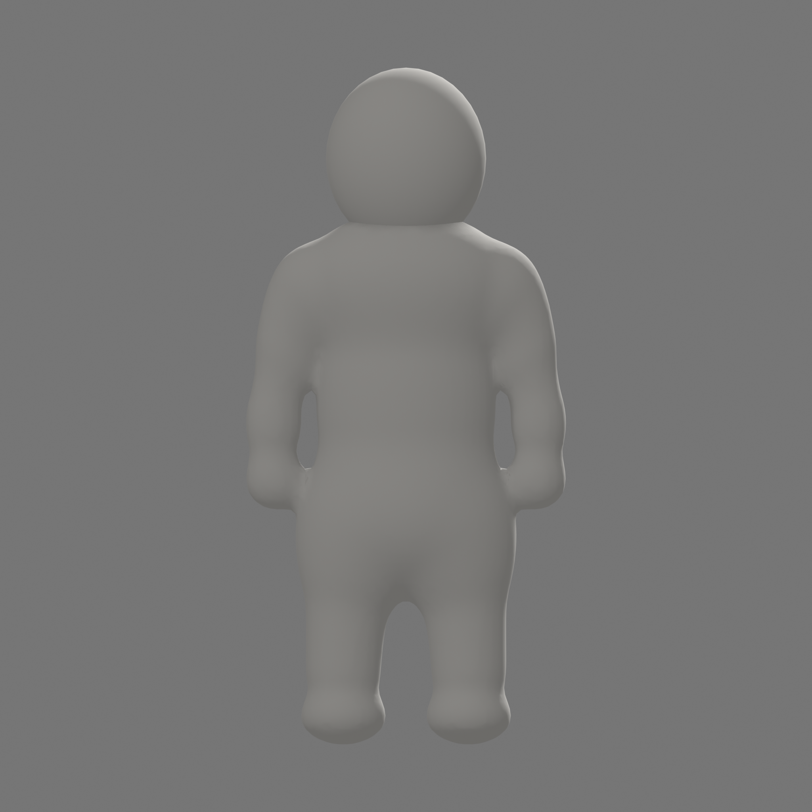
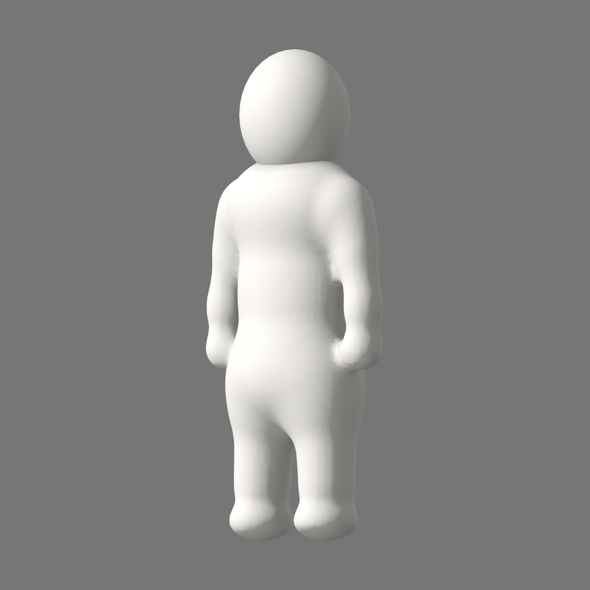

# C1B Neutral 전면 재작업 검토

## 상태

| 항목 | 값 |
|---|---|
| 작업 | `C1BRW-001..002` |
| 현재 Gate | `C1BRW-003 / UG-C1B-NEUTRAL` 사용자 검토 대기 |
| 후보 | `CHR_MasterCharacter_C1B_NeutralRework_r02` (`START / USER_REVIEW`) |
| 성격 | C1b 형태·연속성 검토용 START Mesh |
| 사용자 승인 | `0` |
| Pose·Animation·FBX·Unity import | 승인 전 실행 `0` |
| Production topology·UV·weight·LOD | C4 후속 |
| Player Build | 실행 `0` |

이 보고서는 기존 C1B-002..005 결과가 수치·반입에는 일치했지만 승인된 v0.13 디자인 방향과 달랐다는
사용자 지적을 반영한다. 과거 Evidence는 당시 기술 결과로 보존하되, 현재 캐릭터 승인 입력에서는 제외한다.

[현재 r02 Blender source](../../BlenderSource/Characters/C1B-RW-002-r02/CHR_MasterCharacter_C1B_NeutralRework_r02.blend) ·
[현재 r02 Profile](../../config/character/CharacterProportionProfile-C1B-RW-001-r02.yaml) ·
[역사 r01 Profile](../../config/character/CharacterProportionProfile-C1B-RW-001-r01.yaml) ·
[역사 r01 Technical Evidence](../evidence/G0/C1BRW-002/EV-C1BRW-001-002-20260830-r01.yaml)

r01 profile/source/Evidence는 당시 기술 검증 기록으로 보존한다. rounded-square head와 authored neck인 r01 시각
결과만 `REWORK_REQUIRED`이며 current r02 profile/Neutral이 이 Gate의 입력이다.

## 승인된 방향

형태 목표는 pixel 복제가 아니라 다음 관계다.

- 각지거나 둥근 사각형이 아닌 둥근 머리
- 가시 neck과 authored Neck semantic node 없이 몸통에 직접 overlap/attachment되는 머리
- torso→shoulder→arm의 visible seam·groove·step·cap·detached boundary `0`
- 별도 손·주먹 없이 둥글게 닫힌 forearm terminal
- 몸통·골반·U자형 가랑이에서 자연스럽게 갈라지는 짧은 양다리
- 별도 발·신발 없이 ground contact를 가진 둥근 lower-leg terminal
- 거대한 egg 몸통, 분리 peg limb, 노출된 원형 proximal cap과 배경 관통 `0`

## 새 Neutral 후보

### Front

### Side

### Back

### ThreeQuarter

## 기술 확인

| 항목 | 결과 |
|---|---:|
| Source SHA-256 / bytes | `548a786a50eb28dc8e2b12fe2cf2ddc4032471d8774ff1fa4c02e0f667d6e252 / 520225` |
| Render Mesh object | `1` |
| Closed component | `2` — seamless body field + closed round head direct overlap |
| Vertex / Edge / Polygon | `11394 / 24864 / 13470` |
| Bounds H/W/D | `1.0 / 0.4725346267223358 / 0.23389440774917603` |
| Boundary / non-manifold / loose edge / degenerate face | `0 / 0 / 0 / 0` |
| UV layer | `0` |
| X mirror | 필수, 자동 검증 대상 |
| Neutral/Silhouette fixed view | `4 + 4` |
| Armature / Action / Collider | `0 / 0 / 0` |
| 별도 visible hand/finger/fist/foot/shoe/toe | `0` |

r02는 seamless body field와 closed round head를 한 object 안에서 직접 overlap/attachment한 START 검토 Mesh다.
두 closed component는 visible gap이나 neck을 허용한다는 뜻이 아니다. C1b 시각 방향 검토용이며 production
retopology·UV·skin weight 승인을 뜻하지 않는다.

## 사용자 검토 체크포인트

- [ ] 머리가 각진/rounded-square mass가 아닌 둥근 mass로 읽힌다.
- [ ] 가시 neck 없이 머리가 몸통 상단에 직접 붙어 읽힌다.
- [ ] torso→shoulder→arm에 visible seam, groove, step, cap 또는 detached boundary가 없다.
- [ ] 팔 끝이 평평한 원형 절단면이나 별도 손처럼 보이지 않는다.
- [ ] 몸통이 거대한 egg 또는 상자처럼 보이지 않는다.
- [ ] 골반에서 양다리가 자연스럽게 갈라지고 U자형 가랑이가 읽힌다.
- [ ] 다리 끝이 별도 발 없이 둥글게 닫혀 있다.
- [ ] 필수 view에서 cap disc, 깊은 접합 notch, 배경 관통, 뒤집힘이 보이지 않는다.

위 r02 형태가 승인된 뒤에만 `C1BRW-004` Pose8·lineup/Animation과 `C1BRW-005` FBX/Unity parity를 다시
만든다. Production retopology는 계속 C4 후속이다.
