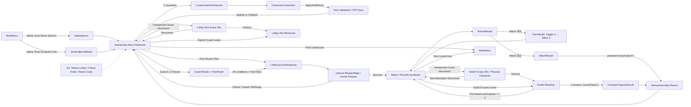

# Project Hotfix UI/UX 기준선

## 0. 문서 정보

| 항목 | 내용 |
|---|---|
| 문서명 | Main Menu, Interactive Lobby, Customizer & Match UI Baseline |
| 문서 버전 | 1.8.0 Alpha Minimal Match UI·Leave·Quality Baseline |
| 기준일 | 2026-08-26 |
| 기준 문서 | `docs/01_PRD.md` 1.8.0, `docs/02_SRS.md` 1.8.0 |
| 패치 기준 | `docs/PATCH_DESIGN.md` 0.5.0 Approved Firearm Runtime Baseline |
| 입력 기준 | 키보드·마우스, 16:9 우선 |
| 현재 목표 | Alpha LAN/direct endpoint 2·3·4인 Vertical Slice |

이 문서는 사용자가 MainMenu에서 Session에 들어가 Lobby에서 놀고 꾸미며, Guest Ready와 Host
Start를 거쳐 Match를 끝낸 뒤 같은 Lobby로 돌아오는 화면 흐름을 정의한다. Protocol 상세나
byte layout을 만들지 않으며 제품 상태를 사용자가 이해할 수 있는 화면과 행동으로 번역한다.

### 0.1 1.8.0 개정 요약

- persistent Match HUD의 timer·alive·ammo·killfeed·result panel을 모두 제거하고 transient countdown,
  between-round Patch, 연결/오류 문구와 on-demand Tab만 허용했다.
- Ammo·FireMode·Projectile·Supply는 Alpha developer debug로만 확인하고 Player HUD에서는 제거했다.
- Match Esc를 local-only non-pausing menu로 고정하고 local input neutral·Mouse all-up rearm을 추가했다.
- explicit Leave, unexpected disconnect grace, timeout Forfeit와 남은 참가자 수에 따른 continue/Lobby 경계를 추가했다.
- Alpha 품질을 Greybox Lobby·최소 placeholder Cosmetic·한국어·BGM0·기본 SFX로 제한했다.

### 0.2 1.7.0 개정 요약

- Pistol semi-auto total7, LongGun full-auto total30과 reserve/reload0의 Ammo 기능 상태를 반영했다.
- Ammo0 forced release→SpentPendingCleanup 2~4초→remove와 next-pulse replacement를 구분했다.
- Host Projectile first-hit/TTL/OOB/Result와 Pistol single recoil·LongGun cumulative SpreadBloom debug 상태를 추가했다.
- 일반 UI Weapon 이름, reserve/reload prompt와 Client-predicted Hit/Ammo 성공 표시는 0으로 유지했다.

### 0.3 1.6.0 개정 요약

- Ground L/R Punch·hold Grab과 Airborne L/R Kick·dual-click Dropkick의 context help를 추가했다.
- Single Air Kick의 chord-close 확정, valid chord의 즉시 Dropkick commit, hold Grab 우선순위와
  `AirAttackToken`·`DropkickRecovery` debug state를 반영했다.
- W1이 Air attack mapping을 덮어쓰지 못하게 하고 Airborne WeaponUse는 별도 사용자 결정으로 남겼다.
- Hybrid animation matrix와 brand-free M1911-inspired/AK-47-inspired/baseball-bat/sledgehammer 기능
  검증을 추가하되 실제 모델명·logo·marking은 사용자-facing UI에서 제외했다.
- ReadyTeal·Patch12·Supply의 기존 계약은 그대로 유지했다.

### 0.4 1.5.0 개정 요약

- 승인 Patch12의 Supply·Weapon Hit 네 조합을 기존 평문 Trigger→Effect 선택 흐름에 추가했다.
- 반복 Supply의 인원별 `START` 시간·cap과 `Incoming/Loose/Held`, `CapacityLimited`, OOB next-pulse,
  SuddenDeath cancel·reset을 Alpha 평문 기능 상태로 확인하게 했다.
- Patch09·10의 capacity admission과 Patch11·12의 Forced Drop 결과를 완성 HUD·연출 없이 같은
  semantic presentation port로 표시하게 했다.
- Guest Ready의 `ReadyTeal + check icon + 준비 완료/준비 취소 label` 계약은 그대로 유지했다.

### 0.5 1.4.0 개정 요약

- Alpha 패치 선택을 PatchAuthor의 plain text `Trigger 2개 → Effect 2개`, timer와 결과 문장으로 고정했다.
- 비작성자 대기·결과 문장과 모든 참가자의 활성 패치 최대 3개 text 표시를 추가했다.
- 패치 icon·전환 Animation·VFX·SFX·최종 Layout을 Alpha 기능 승인 범위에서 제외했다.
- Runtime 의미 event와 presentation port를 분리해 UI가 패치 판정을 소유하지 않게 했다.
- Guest Ready의 `ReadyTeal + check icon + 준비 완료/준비 취소 label` 계약을 유지했다.

### 0.6 이미지 사용 경계

- MainMenu와 CharacterCustomizer 승인 이미지는 정보 구조, graphite·off-white·Amber 비율과 component 밀도 참고다.
- InteractiveLobby v2 이미지는 playfield-first HUD와 world 공간 배치 참고이며 pixel-perfect Layout이 아니다.
- Legacy PrivateLobby와 이전 Lobby 이미지는 색·Typography 일부만 참고할 수 있고 정적 rail·Player card 배치는 사용하지 않는다.
- 모든 기준 이미지의 Character 비율·손 Shape·Rig·의상은 캐릭터 제작 기준이 아니다.
- 이미지에 그려진 물리 StartLever, `[R] Ready`, scale tool과 UI Start의 이전 위치는 현행 입력·상태 계약보다 우선하지 않는다.
- 현행 Host Start는 Lobby action slot의 UI Button이고, Guest Ready 표시는 `[E]`·Mouse 기준이며, Cosmetic scale control은 없다.

---

## 1. UX 목표와 공통 원칙

### 1.1 목표

1. Alpha 사용자가 10초 안에 Host direct session과 direct endpoint join 중 하나를 선택한다.
2. 참가 직후 별도 메뉴 없이 Lobby 캐릭터를 움직인다.
3. Host, Guest 연결, 외형과 Ready 상태를 playfield를 가리지 않고 읽는다.
4. Host는 Start가 왜 잠겼는지 즉시 이해하고 Guest는 무엇을 해야 하는지 안다.
5. 외형 적용, Guest Ready와 Host Start를 서로 다른 행동으로 이해한다.
6. Alpha direct transport와 G4 Steam surface가 같은 화면에서 섞이지 않는다.

### 1.2 공통 원칙

- **Playfield First**: Lobby 중앙 70% 이상을 panel 없는 실제 3D view로 유지한다.
- **One Role Action**: 같은 action slot에 Guest는 Ready, Host는 Start 하나만 표시한다.
- **Host Has No Ready**: Host를 Ready/NotReady로 표현하거나 Guest Ready 수에 포함하지 않는다.
- **Reason Before Disable**: disabled Start 가까이에 가장 우선인 실제 이유를 표시한다.
- **Cursor Without Pause**: Esc Cursor 동안 local input만 neutral이며 Session 물리는 계속된다.
- **Match Menu Without Pause**: Match Esc menu도 local-only이며 simulation·timer·Hazard를 멈추지 않는다.
- **No Persistent Match HUD**: timer·alive·ammo·killfeed·result panel을 gameplay 위에 상시 표시하지 않는다.
- **Shared Camera**: Lobby·Match에서 Mouse로 Camera를 돌리거나 Zoom하지 않는다.
- **Non-color Status**: 색상과 함께 icon, label, outline을 사용한다.
- **No Hidden Service**: 존재하지 않는 Backend 연결·Queue·DB·Server allocation 단계를 표시하지 않는다.
- **Phase Honest UI**: Alpha에 Steam action을, G4에 direct-development action을 제품 fallback처럼 노출하지 않는다.

### 1.3 시각 언어

- Neutral graphite base, off-white text, 제한된 `ActionAmber`, `ReadyTeal`, `ErrorCoral`
- 1px divider와 명도 차이, 4~6px corner radius
- 36~44px 높이의 compact desktop control
- 큰 mobile touch button, pill, gradient, glass blur, metal frame, bolt, bevel 사용 금지
- Alpha 고정 style profile의 14~18px 본문·상태 text. 사용자 UI Scale control은 post-Alpha
- 16:10과 ultrawide에서는 중앙 최대 너비를 유지하고 3D view를 확장

---

## 2. 전체 화면 흐름



### 2.1 흐름 규칙

- Alpha는 Host direct session과 direct endpoint join만 제공한다.
- G4 Steam build는 Steam identity, Friends Lobby, friend invite, Steam code와 P2P/SDR를 조건부로 제공한다.
- Steam code·invite는 같은 Steam Lobby와 방장 AuthorityHost로 들어가며 별도 Dedicated Server를 배정하지 않는다.
- `C`는 Lobby 어디서든 같은 `EnterCustomizationRequest`를 보낸다. Booth 근접 조건은 없다.
- Customizer 진입은 Host면 Start를 잠그고 Guest면 Ready를 해제한다.
- 외형 적용 성공 또는 Fallback 뒤에도 Guest를 자동 Ready하지 않는다.
- Host는 Ready하지 않으며 외형 확정 뒤 Start 조건만 다시 계산한다.
- MatchResult 뒤 Guest는 NotReady가 되고 Host의 Start Button은 처음부터 같은 slot에 다시 보인다.
- Guest explicit Leave는 grace 없이 즉시 Forfeit한다. Unexpected disconnect만 30초 grace를 사용한다.
- Grace 중 Character는 Neutral Input이지만 physical·vulnerable 상태와 Alive Camera subject를 유지하며
  reconnect는 현재 Alive/Spectator state로 돌아온다.
- Timeout Forfeit 뒤 permanent participant가 2명 이상이면 Match를 계속한다. 1명이면 새 Score·Patch 없이
  transient `OpponentLeft` 뒤 Lobby로 돌아간다. Forfeit event는 PatchAuthor가 아니다.
- Host Leave·Loss는 phase와 무관하게 Session을 종료한다.

---

## 3. 공통 입력과 Context

### 3.1 기본 입력

| 입력 | Lobby | Match | UI Context |
|---|---|---|---|
| `WASD` | 이동·자동 회전 | 이동·자동 회전 | UI focus 중 neutral |
| `Left Shift` hold | Sprint | Sprint | text/modifier 용도 외 gameplay 없음 |
| `Space` | Jump | Jump | Main·Modal·Customizer의 focused control 실행 |
| `LMB/RMB` | Ground 손별 Punch/Grab, Air 발별 Kick·dual chord Dropkick·hold Grab | Ground held-Weapon 동작은 W1, Air mapping은 보존 | Cursor·Customizer pointer |
| `C` | 어디서든 Customizer 진입 | 없음 | — |
| `E` | Guest Ready/CancelReady | 없음 | Host Start와 무관 |
| `Tab` | 없음 | 점수·활성 패치 Overlay | Settings의 Hold/Toggle mode 적용 |
| `Esc` | Cursor open/close | Local-only non-pausing menu | Modal/Customizer back·confirm |

- `Left Shift` Sprint는 stamina나 별도 meter를 만들지 않는다.
- `Q/E` character rotation과 Mouse gameplay camera input은 없다.
- Host에게 `E Ready`, `E Start`와 Ready key hint를 표시하지 않는다.
- World prop과 P00 Crane lever는 LMB/RMB 손 조작을 사용한다.
- Lobby 경기 시작은 world object가 아니라 Host Start UI Button이다.

### 3.2 Ground/Air Tap·Hold·Chord help

Alpha MainMenu에는 key help를 넣지 않는다. 아래 문구는 Lobby ContextPrompt와 developer debug에서
resolver를 검증하기 위한 text이며 post-Alpha onboarding의 입력 source다. Match Player HUD에는 표시하지 않는다.

Grounded 기본 문구는 `[LMB/RMB] 짧게: 해당 손 펀치 · 길게: 해당 손 잡기`다. Button down 즉시 Punch가
아니라 Pending 뒤 release 또는 hold로 갈린다는 사실을 Lobby context에서 보여줄 수 있다.

Airborne non-Down 기본 hint는 다음 의미를 짧게 제공한다.

```text
[LMB] 짧게: 왼발 킥  [RMB] 짧게: 오른발 킥
[LMB+RMB] 빠르게: 드롭킥  [LMB/RMB] 길게: 해당 손 잡기
```

- Single quick release는 `DualClickChordWindow`가 닫힐 때까지 pending으로 보이고 반대 down edge가 없을 때
  좌/우 Kick으로 확정한다.
- 반대 두 button down edge가 같은 window 안에 들어오면 두 pending을 즉시 소비해 Dropkick 하나를
  commit한다. 별도 quick release를 요구하거나 좌우 Kick을 추가 표시하지 않는다.
- Chord 전 `GrabHoldThreshold`를 넘긴 미commit single pending은 Kick을 취소하고 해당 손/ledge Grab으로
  바뀐다. 이미 commit된 Dropkick을 hold로 되돌리는 UI는 0이다.
- `DualClickChordWindow`는 60/80/100ms를 비교하고 Alpha debug `START`는 80ms다. gameplay Settings
  slider로 제공하지 않는다.
- `AirAttackToken`을 소비한 episode에서는 quick tap/chord 공격 hint를 disabled state로 바꾸되 hold Grab
  help는 유지한다. Stable Grounded, GetUp 또는 reset은 Token을 복원한다.
- Token이 먼저 복원돼도 `DropkickRecovery` 종료 전 Punch·Kick·Dropkick·Weapon attack hint와 요청은
  잠긴 상태를 유지한다.

Weapon input은 W1 사용자 결정 전 임시 문구를 확정하지 않는다. W1은 위 Air L/R Kick·dual chord·hold
Grab mapping을 바꿀 수 없다. 승인 전 Airborne tap/chord는 WeaponUse보다 Kick/Dropkick이 우선하며,
Airborne WeaponUse 허용 여부와 별도 action/mode가 승인된 뒤에만 Lobby/developer 문구를 추가한다.

### 3.3 Lobby Cursor Mode

1. FreeRoam에서 `Esc`를 누르면 Cursor를 열고 UI focus로 전환한다.
2. 전환 sample부터 새 Hand intent를 만들지 않는다.
3. Pending single/chord·GrabSeek·Grabbing은 non-attack cancel하고 Punch·Kick·Dropkick·Throw impulse를 만들지 않는다.
4. Cursor 동안 LMB/RMB는 UI pointer이며 Hand command를 만들지 않는다.
5. 다시 `Esc`를 누르면 Cursor를 닫고 캐릭터 view로 돌아간다.
6. 닫는 순간 LMB/RMB 중 하나라도 held면 `HandInputArmed=false`로 유지한다.
7. 모든 Mouse button의 up을 관측한 다음 새 down edge부터 Hand input을 재개한다.

재무장 대기 중 `[LMB/RMB] 버튼을 놓으면 조작` hint를 표시한다. held와 button-up 자체를 Punch, Kick,
Dropkick, Grab, Release 또는 Throw로 해석하지 않는다. Cursor가 열려 있어도 다른 플레이어의 충돌과 공용
Camera는 계속된다.

### 3.4 Tab Overlay mode

- Settings에서 `Hold` 또는 `Toggle`을 선택한다.
- 기본값은 `Hold`다.
- `Hold`: Tab을 누르는 동안만 표시한다.
- `Toggle`: press edge마다 열기·닫기를 전환하고 key repeat를 무시한다.
- 내용은 현재 점수와 활성 패치 최대 3개뿐이다.
- map, roster, ping, identity, weapon inventory와 debug 정보는 넣지 않는다.
- Lobby에서는 Tab Overlay를 열지 않는다.

### 3.5 Match local-only menu

1. Match에서 `Esc`를 누르면 local menu를 열고 그 Player의 gameplay Input을 Neutral로 만든다.
2. AuthorityHost simulation, Round timer, Hazard, 다른 Player와 local Character에 가해지는 외부 physics는 계속된다.
3. Menu 입력을 Punch·Kick·Dropkick·Grab·Throw·WeaponUse로 queue하거나 replay하지 않는다.
4. 다시 `Esc` 또는 Close로 menu를 닫아도 LMB/RMB가 held면 Hand·Weapon Input은 Disarmed 상태다.
5. 모든 Mouse button up을 본 뒤 새 down edge부터만 gameplay Input을 재개한다.

이 menu를 `Pause`라고 표시하거나 Host가 열었다는 이유로 Session을 멈추지 않는다.

---

## 4. MainMenu

### 4.1 Alpha 화면

| 영역 | 내용 |
|---|---|
| 왼쪽 Action Rail | `Host Direct Session`, `Direct Endpoint Join`, `Settings`, `Quit` |
| 중앙·오른쪽 Stage | MasterCharacter와 low-poly map diorama |
| 상단 오른쪽 | local display name과 Host/Guest 선택 상태 |
| 하단 오른쪽 | Build version과 active transport 상태 |

- `Host Direct Session`은 local listen endpoint를 열고 성공 뒤 Lobby로 이동한다.
- `Direct Endpoint Join`은 endpoint 입력 Modal을 열며 입력값을 오류 뒤에도 보존한다.
- public server list, quick match, matchmaking, rank와 MMR control은 만들지 않는다.
- Alpha 화면에 Steam persona, friend invite와 Steam code를 표시하지 않는다.
- 별도 Backend, Coordinator, DB와 allocation 상태를 표시하지 않는다.
- Alpha MainMenu에는 key help·tutorial panel을 표시하지 않는다. 이 기능은 post-Alpha다.

### 4.2 G4 Steam 화면

G4 build에서는 Main action을 `Steam Lobby 만들기`, `Steam 친구 초대`, `Steam 코드로 참가`로
교체한다. Steam code는 checksum이 포함된 `SteamLobbyId`의 사람이 읽는 가역 표현이다.

- code decode 오류는 문자를 보존하고 수정·재시도를 제공한다.
- checksum 성공만으로 참가 성공이나 권한 검증 완료를 표시하지 않는다.
- 실제 Steam Lobby join과 remote Steam identity 확인 뒤 Lobby를 연다.
- Steam code를 비밀번호나 secret token처럼 설명하지 않는다.
- 자체 Backend 접속 단계나 Dedicated Server allocation 문구를 표시하지 않는다.

---

## 5. InteractiveLobby HUD

### 5.1 화면 구조

| 영역 | 내용 |
|---|---|
| 3D Play View | 화면 전체, 중앙 70% 이상 무패널 |
| `RoomChip` | 좌상단 Session 종류·Host·connection summary·explicit leave |
| `RosterPanel` | 우상단 최대 4명의 display name, Host, 연결, 외형, Guest Ready |
| `RoleActionSlot` | 좌하단 Guest Ready 또는 Host Start |
| `PersonalAction` | RoleAction 옆 `[C] 꾸미기`, `[Esc] UI` |
| `ContextPrompt` | 하단 중앙 현재 손·prop·Crane lever hint |
| `StartGateReason` | Host Start 근처 한 줄 disabled reason |
| `TransientToast` | 상단 중앙 외형·연결·일반 오류 |

HUD에는 map 이름, Thumbnail, vote, Random label, candidate pool과 content 목록을 표시하지 않는다.
Lobby 추락에는 skull, kill feed, score와 defeat screen을 사용하지 않는다.

### 5.2 Roster

각 행은 다음 순서를 사용한다.

1. Host 또는 본인 marker와 display name
2. `Connected` 또는 reconnect countdown
3. `Default`, `Editing`, `Checking`, `Synced`, `Fallback` 외형 상태
4. Guest만 `NotReady | Ready`; Host 행에는 Ready field 없음

빈 자리는 한 줄의 `친구를 기다리는 중`으로 합친다. Disconnect grace 중인 Guest는 행을 유지하지만
Start 조건에서는 연결되지 않은 Guest로 처리한다.

- Guest가 RoomChip의 Leave를 명시적으로 누르면 reconnect grace 없이 자신의 Lobby slot을 즉시 제거한다.
- Unexpected Guest disconnect는 roster slot을 30초 예약하고 countdown을 표시한다. Timeout이면 slot을 제거한다.
- Host Leave·Loss는 Lobby Session 전체를 종료하고 Guest에게 transient `HostLoss`를 표시한다.

### 5.3 같은 RoleActionSlot

#### Guest

- `Ready` 또는 `CancelReady` Button을 표시한다.
- FreeRoam에서는 `E`, Cursor Mode에서는 Mouse click으로 전환한다.
- 외형이 확정되지 않았거나 connection이 유효하지 않으면 Ready를 잠그고 이유를 표시한다.
- NotReady 상태는 중립 graphite Button으로, Ready 확정 상태는 `ReadyTeal` Button으로 표시한다.
- ReadyTeal만으로 상태를 전달하지 않고 check icon과 `준비 완료 / 준비 취소` label을 함께 바꾼다.
- Ready 뒤에도 이동·Sprint·Punch·Air Kick·Dropkick·Grab·던지기와 Lobby 추락을 계속할 수 있다.

#### Host

- Lobby 진입 첫 frame부터 같은 위치에 `Start` Button을 표시한다.
- Host에게 Ready Button, Ready state와 Ready count 참여를 제공하지 않는다.
- Start는 Cursor Mode의 Mouse click으로만 실행하고 `E`나 Hand input에 연결하지 않는다.
- 조건 미충족이어도 Button을 숨기지 않고 disabled reason을 표시한다.

### 5.4 Host Start 활성 조건

다음을 모두 만족해야 Start가 enabled다.

1. Host 포함 총 참가자 2~4명
2. 모든 Guest connected
3. 모든 Guest Ready
4. 모든 Guest appearance finalized
5. Host appearance finalized
6. Lobby phase이고 Scene transition 없음

disabled reason 우선순위는 다음과 같다.

1. `친구 한 명 이상이 필요합니다.`
2. `{Name}님의 연결을 기다리는 중입니다.`
3. `내 외형을 확인하는 중입니다.`
4. `{Name}님의 외형을 확인하는 중입니다.`
5. `{Name}님이 준비하지 않았습니다.`
6. `다른 화면을 준비하는 중입니다.`

Host 혼자 또는 NotReady Guest가 있는 상태의 click·shortcut·replayed request는 진행 animation을
시작하지 않는다. AuthorityHost 재검증이 성공한 request만 LobbyLaunchSequence로 전환한다.

### 5.5 물리 StartLever 제거

- Lobby world와 HUD에 경기 시작용 물리 StartLever, lever prompt와 activation progress를 만들지 않는다.
- 이전 이미지의 StartLever는 구현 근거가 아니다.
- P00 `Crane lever`는 Match 안의 Hazard control이며 ContextPrompt에 `[LMB/RMB] 잡아 조작`을 표시할 수 있다.
- Crane lever 조작은 Guest Ready, Host Start와 Match phase 전환을 바꾸지 않는다.

### 5.6 Lobby 추락과 재투입

1. Lobby OOB 확정 시 Camera active subject에서 제외한다.
2. `다시 투입 중`을 짧게 표시한다.
3. Host가 Grab·velocity·Down/Ragdoll residue를 초기화한다.
4. 1~2초 뒤 겹치지 않는 하늘 Spawn에서 재투입한다.
5. 안정된 제어 복구 뒤 Camera subject에 다시 포함한다.

Ready Guest의 Lobby 추락은 Ready를 해제하지 않는다. Host 추락도 상위 Start Gate에 없는 별도
차단 조건을 만들지 않으며 Start 활성 여부는 5.4의 조건만 사용한다.

---

## 6. CharacterCustomizer

### 6.1 진입과 보호

- `C` 또는 Cursor Mode의 `Customize` Button으로 Lobby 어디서든 진입한다.
- Guest가 Ready면 먼저 `준비를 해제하고 꾸미시겠습니까?` 확인 뒤 Ready를 해제한다.
- Host에는 Ready confirm이 없고 진입 즉시 Start를 disabled로 만든다.
- Host가 CustomizationProtected 상태를 승인하면 active Grab을 끊고 외부 collision·attack·throw 영향을 차단한다.
- Lobby Scene과 active P2P connection은 유지한다.
- 여러 플레이어가 동시에 편집할 수 있으며 Booth queue를 만들지 않는다.
- Alpha InteractiveLobby world와 props는 기능을 읽을 수 있는 Greybox 품질이면 충분하며 production
  environment art lock은 post-Alpha다.

### 6.2 Desktop Editor Layout

| 영역 | 내용 |
|---|---|
| `CommandBar` | Paint·Cosmetic·Preset Tab, Undo/Redo, `ApplyAndReturn` |
| `AssetBrowser` | Brush 또는 3D Cosmetic 목록 |
| `CharacterViewport` | 가장 큰 전신 Preview·rotate·zoom |
| `Inspector` | 선택 항목 정보, Preset 0/10, Cosmetic 0/16 |
| `ViewportToolbar` | Cosmetic surface move·3축 rotate·duplicate·delete |

Scale gizmo, scale slider, numeric scale와 scale shortcut을 제공하지 않는다.

### 6.3 Paint

- BaseColor, AccentColor, Brush, Erase, Brush size, Palette, symmetry, Undo/Redo, Reset
- 3D character surface hit만 Stroke로 기록하고 UI drag는 그리지 않는다.
- 파일·clipboard image·URL·Sticker import control을 만들지 않는다.
- color와 Stroke는 local Preview와 Preset source에 포함된다.

### 6.4 Cosmetic

- Alpha catalog는 `EyeSet`, `Mustache`, `Headwear` placeholder 대표 1개씩 또는 아래 편집·저장·Host
  검증의 같은 기능 범위를 가진 동등 최소 game-authored 집합이다.
- category는 검색 filter일 뿐 배치 부위를 제한하지 않는다.
- game catalog의 고정 Mesh·색상·authored size만 사용한다.
- 전신 외부 표면 어디든 drag하고 위치·3축 회전·복제·삭제한다.
- 관절·팔 terminal·발바닥도 invalid로 표시하지 않는다.
- 중첩, Cosmetic 겹침과 Character Mesh 시각 관통을 그대로 보여준다.
- Prototype budget은 최대 16 instance이며 초과 시 새 배치·복제만 막는다.

### 6.5 Preset과 local atomic save

- local Preset은 최대 10개다.
- Save, Load, Overwrite, Rename, Delete를 제공한다.
- save 진행 중 중단돼도 이전 정상본이 남도록 atomic save 상태를 사용한다.
- load는 같은 frame의 local Preview에 적용한다.
- Guest load는 Ready를 해제하고 Host load는 Start를 잠근다.
- Preset 목록에 Cloud, Backend sync, upload와 shared account 상태를 표시하지 않는다.

### 6.6 Apply와 P2P sync

사용자-facing 상태는 다음으로 제한한다.

```text
Editing → SendingToHost → HostChecking → Syncing → Applied
                                      └→ DefaultFallback
```

- `ApplyAndReturn` 뒤 Lobby FreeRoam으로 돌아오되 외형 확정 전 Ready·Start를 잠근다.
- Host는 bounded source, Stroke, color, catalog item과 instance 제한을 검증한다.
- 성공하면 Host가 승인된 source와 appearance revision을 Peer에 relay한다.
- 실패하면 해당 플레이어만 DefaultFallback으로 확정하고 재편집 행동을 제공한다.
- Backend queue, bake worker, blob upload/download와 server correlation 단계를 표시하지 않는다.

---

## 7. LobbyLaunch, Match와 Result UI

### 7.1 LobbyLaunchSequence

1. Host가 enabled Start Button을 Cursor click한다.
2. AuthorityHost가 인원, Guest 연결·Ready·외형, Host 외형과 phase를 다시 검증한다.
3. 성공하면 모든 Grab과 Lobby input을 정리하고 짧은 departure feedback을 표시한다.
4. 내부 호환 map pool에서 한 맵을 선택한다.
5. 선택·load에 실패하면 Lobby를 유지하고 Guest를 NotReady로 되돌린다.
6. 성공하면 같은 connection에서 Match Scene을 준비·활성화한다.

`Preparing Match`에는 `입력 정리`, `콘텐츠 확인`, `Scene 불러오기`, `친구 준비 대기` 같은 현재
단계만 표시한다. map 후보·선택 결과, Dedicated Server와 JoinTicket 문구는 표시하지 않는다.

### 7.2 Match Player UI와 Developer Debug

§3.5의 local Esc menu를 제외한 Alpha Player-facing Match gameplay UI 허용 목록은 다음이 전부다.

- Match Scene 활성화 뒤와 각 Round reset 뒤 transient `3 · 2 · 1 · 시작`
- Round 사이의 plain-text Patch 선택·대기·결과와 활성 목록
- transient `OpponentLeft`, `HostLoss`와 error message
- 사용자가 Tab으로 요청한 전체 Score·Active Patch overlay

Persistent timer, alive state, Ammo, killfeed와 result panel은 각각 0이다. Active Patch도 Playing 중에는
persistent summary로 띄우지 않고 on-demand Tab 또는 between-round 결과에서만 본다. Down/Ragdoll·groggy,
Player identity와 Weapon state는 Character pose·world presentation으로 읽되 stack·alive·Ammo HUD를 만들지
않는다. Sprint stamina bar, Weapon name, magazine과 reload prompt도 0이다. Local Esc menu는 HUD가 아니며
§3.5의 non-pausing·Neutral Input·all-up rearm 계약만 사용한다.

다음 정보는 Alpha developer debug에만 있고 Player HUD·Tab·MainMenu에는 나타나지 않는다.

- `AirAttackToken`, pending side, chord elapsed/window, committed `Kick|Dropkick`, `DropkickRecovery`
- 다음 Supply Pulse, `Incoming+Loose+Held+SpentPendingCleanup / cap`, admission·cleanup 결과
- `FireMode`, `AmmoRemaining`, Fire accepted/rejected reason, ShotSequence, ProjectileId·TTL·first-hit,
  RecoilAccumulator·SpreadBloom과 Spent deadline

Developer debug는 Host state를 읽기만 한다. Client prediction으로 Ammo를 먼저 줄이거나 hit marker·Damage
success를 확정하지 않는다. Pistol은 press마다 한 번, LongGun은 valid hold cadence만 debug fire result를
기록하고 Playing+SuddenDeath에서는 동작하며 RoundResult부터 새 Fire·active Projectile은 0이다. Ammo0의
last Shot→forced release→Spent deadline remove와 next-pulse replacement를 즉시 respawn 하나로 합치지 않는다.

Hybrid animation 검증 capture는 locomotion·Jump phase, L/R Punch·Air Kick, Dropkick/Recovery,
Grab/Lift/Throw, Weapon Fire/Swing과 Ragdoll/GetUp을 Host action/state와 함께 표시한다. Animation의
gameplay root motion·hit·impulse·Down mutation은 0이어야 한다.

Weapon functional ID와 W1 action 문구는 Lobby/developer context에서만 사용한다. M1911·AK-47을 reference로
한 asset이라도 실제 모델명, 제조사명, logo·marking·serial을 Player UI에 표시하지 않는다.
Pistol/LongGun/Bat/Hammer의 debug ID를 사용자 이름으로 취급하지 않는다.

### 7.3 PatchBuild Alpha 기능 UI

Match가 끝나지 않은 Round의 Result 뒤 지정 PatchAuthor만 선택 control을 받는다.

```text
작성자: Trigger text 2개 중 1개
     → 선택 Trigger와 호환되는 Effect text 2개 중 1개
     → AuthorityHost 확정 결과 문장

비작성자: "{Name}님이 패치를 고르는 중 · {남은 시간}"
       → AuthorityHost 확정 결과 문장
```

- 작성자는 plain text Trigger 두 개를 동시에 보고 하나를 선택한다.
- Trigger 확정 뒤 plain text Effect 두 개로 교체하고 같은 총 제한시간의 남은 값을 숫자로 표시한다.
- Timeout이면 AuthorityHost가 노출된 유효 후보 중 하나를 확정하며 모든 참가자가 같은 결과 문장을 본다.
- 결과 문장은 `PATCH_DESIGN.md` 0.5.0의 승인 Patch12 문장을 그대로 사용하고 UI가 문장을 조합해 규칙을 만들지 않는다.
- 모든 참가자는 결과 뒤 다음 Round의 활성 패치 목록을 오래된 순서로 최대 3개 plain text로 본다.
- Active 목록에는 같은 Trigger의 Patch가 둘 이상 함께 나타나지 않는다. 후보 필터의
  `TriggerOccupancy` 결과를 그대로 표시하고 UI가 별도 예외를 만들지 않는다.
- FIFO로 빠질 패치가 있으면 Alpha에서는 별도 연출 없이 text 상태 변경으로 확인할 수 있다.
- 비작성자는 선택 control을 받지 않으며 대기 중 gameplay command를 다음 Round에 queue하지 않는다.

Alpha 승인에 patch icon, 카드 Illustration, 선택·activation Animation, VFX, SFX와 최종 panel Layout은
필요하지 않다. 단순 Button·text·timer로 Trigger 선택, Effect 선택, Timeout, 결과, 다음 Round 실제
적용과 2·3·4인 동일 상태를 검증한다.

Patch UI는 AuthorityHost가 발행한 의미 selection/activation event를 presentation port로 구독한다.
UI click은 선택 request만 제출하며 Trigger 성립, 대상, modifier, FIFO와 Round 적용을 직접 확정하지
않는다. 이후 icon·Animation·Audio·VFX는 같은 port의 별도 subscriber로 추가하고 Simulation 계약을
변경하지 않는다.

### 7.4 반복 Supply·Forced Drop Developer Debug

Developer 전용 기능 시험 Text Adapter는 Host의 권한 결과만 다음처럼 표시할 수 있다. 이 text는
Player HUD·Tab·between-round Patch 화면에 포함하지 않는다.

```text
보급: 다음 Pulse 8초 · 현재 1/2 (Incoming+Loose+Held+Spent)
보급 결과: 1개 생성 / 0개 · CapacityLimited
무기 상태: Incoming → Loose
패치 발동: PATCH-PROT-011 · 대상 무기 2개 ForcedDrop
```

동적 DropZone 또는 landing clearance가 없으면 Alpha 진단 text에 `NoSafeDropZone` 또는
`LandingBlocked`를 표시한다. 이는 최종 HUD 알림이 아니며 backlog·즉시 대체 투하를 암시하지 않는다.

- 인원별 Base profile은 2인 `10초/22초/cap2`, 3인 `8초/16초/cap2`, 4인
  `6초/12초/cap3`으로 표시·검증한다.
- 현재 Round profile은 시작 participating roster로 고정하며 disconnect·reconnect·forfeit 표시 변화로
  timer·cap을 다시 계산하지 않는다.
- `PATCH-PROT-009`는 원하는 2개 중 실제 capacity가 허용한 수량과 `CapacityLimited`를 표시한다.
- `PATCH-PROT-010`은 Base Pulse와 `START 6~10초` 뒤 파생 Wave를 구분한다. 파생 Wave가 다시 Patch를
  Trigger하거나 full 상태에서 queue·재시도하는 것처럼 표시하지 않는다.
- Weapon OOB는 `다음 정규 보급에서 확인`으로 처리하며 즉시 respawn countdown을 만들지 않는다.
- SuddenDeath 또는 Round Result에서는 pending Supply 표시를 취소한다. Incoming·Loose·Held는 Round reset까지
  유지하고 Spent는 SuddenDeath에서도 독립 deadline에 제거한다. Round reset은 Weapon/Ammo/Projectile,
  count·timer·pending wave를 baseline으로 되돌린다.
- Incoming Weapon에는 Pickup·공격·Map control hint를 표시하지 않고 착지해 `Loose`가 된 뒤에만 기존
  Weapon hint를 사용한다.
- `PATCH-PROT-011`은 victim의 모든 Held Weapon Instance 수를 표시하되 Main·Support가 같은 Instance면
  하나로 세며, 없으면 `NoEligibleTarget`을 표시한다.
- `PATCH-PROT-012`는 attacker가 해당 hit에 사용한 source Weapon 한 Instance 결과만 표시한다.
- Supply bag order, Safe DropZone 후보와 seed는 일반 HUD에 노출하지 않고 Host diagnostic에서만 확인한다.

이 Text Adapter는 developer debug·기능 검증용이다. 보급 marker, 낙하 Animation, 전용 icon·VFX·SFX와
Player Weapon HUD는 Alpha에 없으며 gameplay admission·forced drop을 확정하지 않는다.

### 7.5 MatchResult와 Lobby return

1. MatchResult state는 Host가 확정하되 persistent winner·score·Patch result panel을 열지 않는다.
2. 같은 connection에서 Lobby Scene을 열고 Lobby prop·respawn state를 초기화한다.
3. 모든 Guest를 NotReady로 만들고 Host Ready 없이 Start Button을 원래 slot에 즉시 표시한다.
4. 다음 Match는 조건 재충족 뒤 Host Start click으로만 시작한다.

즉시 Rematch Button, Guest Ready 보존과 Lobby를 건너뛰는 경로는 제공하지 않는다.

### 7.6 Guest Leave·Disconnect·Forfeit

- Guest explicit Leave는 Lobby와 Match에서 reconnect grace를 건너뛴다. Lobby slot은 즉시 제거하고
  Match에서는 즉시 Forfeit한다.
- Unexpected disconnect의 30초 동안 local Input은 Neutral이고 Character는 physical·vulnerable 상태다.
  Alive Character는 Camera subject로 남고 충돌·피해·Down·탈락할 수 있다.
- Reconnect는 Host의 현재 Alive 또는 Spectator state를 복원한다. 과거 Input·Action을 replay하지 않는다.
- Timeout은 Forfeit다. Forfeit event 자체는 PatchAuthor가 아니며, grace 중 gameplay 탈락이 먼저
  확정된 경우에는 그 탈락과 timeout Forfeit를 구분한다.
- Forfeit 뒤 permanent participant가 2명 이상이면 Match를 계속한다. 1명이면 새 Score·Patch 없이
  transient `OpponentLeft`를 표시하고 7.5의 Lobby return으로 간다.
- Host explicit Leave 또는 Loss는 Session을 끝내고 Guest에게 transient `HostLoss` 뒤 MainMenu를 표시한다.

---

## 8. 연결과 오류 UX

| 상황 | 표시 | 다음 행동 |
|---|---|---|
| Alpha endpoint 형식 오류 | `주소를 확인해 주세요.` | 입력 보존, 수정, 재시도 |
| Host 연결 실패 | `방장에게 연결할 수 없습니다.` | 재시도, MainMenu |
| Unexpected Guest disconnect | roster에 `재접속 대기 · 남은 초` | 30초 physical/vulnerable grace, reconnect 또는 timeout Forfeit |
| 내 Guest connection loss | `방장에게 다시 연결하는 중 · 30초` | 자동 reconnect, `지금 나가기`는 즉시 Forfeit |
| Guest explicit Lobby Leave | `방을 나갑니다.` | grace 없이 slot 제거, MainMenu |
| Guest Forfeit 뒤 2명 이상 유지 | transient `OpponentLeft` | Match 계속 |
| Guest Forfeit 뒤 1명 잔존 | transient `OpponentLeft` | Score·Patch 0, Lobby return |
| Host Leave·Loss | transient `방장이 나가 Session이 종료되었습니다.` | MainMenu |
| Host 혼자 Start | `친구 한 명 이상이 필요합니다.` | Guest 참가 대기 |
| NotReady Guest | `{Name}님이 준비하지 않았습니다.` | Guest Ready |
| Appearance pending | `{Name}님의 외형을 확인하는 중입니다.` | 완료 대기, 재편집 |
| Host validation failure | `기본 외형을 사용합니다.` | 계속, 다시 꾸미기 |
| Scene preparation failure | `경기를 준비할 수 없습니다.` | Lobby 유지, 다시 Ready |
| G4 Steam code checksum 오류 | `코드 문자를 확인해 주세요.` | 입력 보존, 수정 |
| G4 Steam Lobby join 실패 | `Steam Lobby에 참가할 수 없습니다.` | 재시도, MainMenu |

Host loss에는 Host Migration·새 owner·Dedicated Server fallback을 제안하지 않는다. Alpha transport
실패에 Steam fallback을, Steam 실패에 direct endpoint 제품 fallback을 제안하지 않는다.

---

## 9. Alpha Settings

- `TabOverlayMode: Hold | Toggle` (`Hold` default)

Alpha에는 BGM playback과 사용자-facing audio channel control이 없고 기본 combat·weapon·environment
SFX를 고정된 개발 mix로 사용한다.

### 9.1 Post-Alpha Settings 재분할

- key rebinding
- UI Cursor sensitivity와 UI scale
- Camera shake·movement·screen effect strength와 off
- subtitle·system message
- 별도 color-vision Player marker
- Patch sentence review
- Master/SFX/UI/Music volume control

위 설정과 MainMenu key help는 별도 post-Alpha Task로 추정·검증하며 Alpha Gate를 막지 않는다.

Left Shift Sprint multiplier, `DualClickChordWindow`, Air Kick·Dropkick physics, groggy duration과 weapon
balance는 사용자 Settings가 아니라 Alpha tuning profile이다. 사용자에게 gameplay advantage slider로
제공하지 않는다. 후속 Key Rebinding과 control help는 Ground/Air context와 W1에서 승인된 별도 Weapon
action을 정확히 반영한다.

### 9.2 Alpha 품질 범위

- InteractiveLobby world와 prop은 Ready·Start·Customizer·free-roam을 검증할 수 있는 Greybox다.
- Cosmetic catalog는 fixed size/color·전신 배치·저장·Host relay를 시험하는 최소 placeholder 집합이다.
- 사용자-facing 언어는 `Korean-only`(한국어 한 종)다. Localization StringTable, 추가 언어와 fallback font는 post-Alpha다.
- MainMenu key help와 tutorial panel은 post-Alpha다. Lobby/developer context text는 기능 검증에만 사용한다.
- BGM은 0곡이다. 고정 개발 mix의 기본 combat·weapon·environment SFX만 만들고 사용자-facing audio
  channel control과 Music·UI·Patch·Supply audio polish는 미룬다.

---

## 10. 구현·검토 체크리스트

### 10.1 MainMenu

- [ ] Alpha에 Host Direct Session과 Direct Endpoint Join만 보인다.
- [ ] G4에서만 Steam Lobby, friend invite와 Steam code가 보인다.
- [ ] public matchmaking·rank·MMR·server browser control이 없다.
- [ ] Backend·Coordinator·Dedicated Server allocation 상태가 없다.
- [ ] Alpha MainMenu key help·tutorial panel이 없다.

### 10.2 InteractiveLobby

- [ ] Host 포함 총 2~4명으로 표시된다.
- [ ] Guest action slot은 Ready, Host의 같은 slot은 처음부터 Start다.
- [ ] Host row와 action에 Ready 상태가 없다.
- [ ] Host 혼자와 NotReady Guest 상태에서 Start 수락이 0이다.
- [ ] 모든 Guest 연결·Ready·외형과 Host 외형 확정 뒤에만 Start가 enabled다.
- [ ] Start는 Esc Cursor의 Mouse click이고 E·Hand·world lever로 실행되지 않는다.
- [ ] Lobby StartLever가 없고 P00 Crane lever는 Match Hazard prompt로만 나타난다.
- [ ] Ready Guest도 이동·Sprint·물리 장난을 계속한다.
- [ ] Esc를 다시 누르면 Cursor가 닫히고 character control로 돌아간다.
- [ ] held Mouse는 all-up 뒤 새 down부터만 Hand input이 된다.
- [ ] Lobby Tab Overlay가 없다.
- [ ] Explicit Guest Leave는 slot을 즉시 제거하고 unexpected disconnect만 30초 reservation을 유지한다.

### 10.3 CharacterCustomizer

- [ ] C로 Lobby 어디서든 들어간다.
- [ ] 외부 image·Sticker·scale control이 없다.
- [ ] 전신 자유배치·3축 회전·중첩·시각 관통이 유지된다.
- [ ] Preset 최대 10개와 local atomic save failure recovery가 보인다.
- [ ] Apply 상태가 Host checking과 P2P sync이며 Backend bake/upload 단계가 없다.
- [ ] Host와 Guest 외형 확정 전 각각 Start·Ready가 잠긴다.

### 10.4 Match

- [ ] Left Shift hold Sprint가 동작하고 stamina HUD가 없다.
- [ ] Tab 설정 Hold/Toggle가 동작하고 score·active Patch 외 정보가 없다.
- [ ] 반복 Down/Ragdoll groggy가 pose·audio로 읽히고 Round reset 뒤 초기화된다.
- [ ] persistent timer·alive·ammo·killfeed·result panel이 각각 0이다.
- [ ] Player UI는 transient countdown·between-round Patch·OpponentLeft/HostLoss/error와 on-demand Tab만 사용한다.
- [ ] W1 승인 뒤 Weapon action은 승인 Air Kick·Dropkick·airborne Grab 입력을 덮어쓰지 않고 Player HUD를 추가하지 않는다.
- [ ] Match Esc menu 중 simulation이 계속되고 local input만 Neutral이며 close 뒤 Mouse all-up 전 오발이 0이다.
- [ ] Explicit Leave·unexpected disconnect·timeout Forfeit와 2명 이상 continue/1명 Lobby return이 Host state와 일치한다.
- [ ] 2인·3인·4인과 16:9·16:10·ultrawide를 각각 검토한다.

### 10.5 Air Attack·Hybrid Animation·Weapon Archetype

- [ ] Ground L/R quick tap은 해당 손 Punch, hold는 해당 손 Grab이다.
- [ ] Air single quick release는 chord window close 뒤 해당 발 Kick이고 hold threshold는 미commit Kick만 Grab으로 취소한다.
- [ ] valid dual down-edge chord는 즉시 Dropkick 하나를 commit하고 두 pending을 소비하며 release 요구·단일 Kick 추가 0이다.
- [ ] AirAttackToken은 episode당 공격 1회이고 stable Grounded·GetUp·reset 뒤 복원된다.
- [ ] DropkickRecovery/tumble은 DownCount·groggy·TRG-DOWN 0이며 Kick/Dropkick은 Patch003/004만 발동한다.
- [ ] Token이 먼저 복원돼도 DropkickRecovery 종료 전 새 Punch·Kick·Dropkick·Weapon attack은 0이다.
- [ ] Cursor 진입·Mouse rearm·reconnect가 pending chord나 Air attack을 중복 commit하지 않는다.
- [ ] Hybrid animation matrix는 Host state와 일치하고 gameplay root motion·authority mutation 0이다.
- [ ] 네 Weapon silhouette가 구분되며 사용자-facing M1911·AK-47·제조사명·logo·marking은 0이다.
- [ ] W1 전 Airborne tap/chord의 WeaponUse는 0이고 후속 Airborne WeaponUse는 별도 승인 action/mode만 사용한다.

### 10.6 Firearm Ammo·Projectile·Recoil

- [ ] Pistol은 accepted press당 Ammo 1 감소·total7, LongGun은 valid hold cadence·total30이며 reserve/reload가 0이다.
- [ ] AmmoRemaining·FireMode·Projectile·Spent는 developer debug에만 있고 Player HUD·Tab에는 0이다.
- [ ] Ammo0은 last Shot→forced release→Spent 2~4초 deadline remove이며 replacement next pulse와 구분된다.
- [ ] Projectile/Hit UI는 Host accepted Shot·first hit만 표시하고 Client prediction false hit marker가 0이다.
- [ ] Pistol single recoil과 LongGun RecoilAccumulator·SpreadBloom cue가 Host ShotSequence와 일치한다.
- [ ] Playing+SuddenDeath Fire cue가 유지되고 RoundResult부터 새 Fire·Projectile cue가 0이다.
- [ ] 2·3·4인 최대 Projectile/Spent developer debug가 gameplay authority나 Player UI를 바꾸지 않는다.

### 10.7 Patch Alpha 기능 UI

- [ ] PatchAuthor만 승인 Patch12의 plain text Trigger 2개에서 하나를 고른 뒤 Effect 2개에서 하나를 고른다.
- [ ] 작성자에게 남은 시간과 결과 문장이 보이고 Timeout도 유효 결과로 끝난다.
- [ ] 비작성자는 작성자 이름·남은 시간 대기 문구 뒤 같은 결과 문장을 본다.
- [ ] 모든 참가자의 활성 패치 최대 3개 text와 FIFO 결과가 일치한다.
- [ ] 같은 Trigger를 공유하는 두 Patch가 active list에 동시에 나타나는 경우는 0이다.
- [ ] Developer debug의 2·3·4인 Supply timer·cap과 Incoming/Loose/Held/Spent 합계가 Host 상태와 일치한다.
- [ ] Developer debug의 cap 부족은 admitted 수량과 `CapacityLimited`를 기록하고 backlog·즉시 재시도를 암시하지 않는다.
- [ ] Developer debug의 NoSafeDropZone·LandingBlocked·Weapon cleanup은 Host 결과와 일치하고 피해·즉시 대체를 암시하지 않는다.
- [ ] OOB는 next regular Pulse, SuddenDeath·Result는 pending cancel, Round reset은 count·timer 0으로 수렴한다.
- [ ] Patch09·10 Supply와 Patch11·12 Forced Drop은 derived Trigger 없이 실제 결과만 표시한다.
- [ ] icon·Animation·VFX·SFX·최종 Layout 없이도 2·3·4인 기능 검증이 가능하다.
- [ ] UI와 후속 presentation subscriber가 패치 Authority state를 변경하지 않는다.

### 10.8 Alpha 품질 범위

- [ ] Lobby Greybox와 최소 placeholder Cosmetic catalog로 전체 기능을 검증한다.
- [ ] Alpha 사용자-facing Text는 한국어 한 종이고 StringTable·추가 언어·fallback font가 Gate가 아니다.
- [ ] BGM은 0곡이고 고정 개발 mix의 기본 combat·weapon·environment SFX만 있으며 사용자 audio channel control은 없다.
- [ ] UI/Music channel control은 post-Alpha다.
- [ ] production Lobby/Cosmetic/Audio polish와 MainMenu key help를 Alpha 완료로 주장하지 않는다.

---

## 11. 후속 사용자 Gate

- W1 Weapon input안, Airborne WeaponUse 허용 여부·별도 action/mode와 Lobby/developer context 문구
- Fire cadence, Projectile speed/radius/TTL, recoil/bloom과 Spent 2~4초 START 중 최종값·developer debug 배치
- Punch/Grab threshold와 DualClickChordWindow 60/80/100ms 최종값
- Air Kick·Dropkick impulse·air steer·DropkickRecovery 체감과 control help
- Sprint multiplier가 주는 이동 체감
- groggy base·increment·cap과 feedback 강도
- InteractiveLobby world prop·Customizer visual anchor의 정확한 배치
- Cosmetic item 최종 조형 수량
- surface drag와 3축 rotation의 정확한 Mouse gesture
- 최종 font family·size와 1440×900·ultrawide layout
- 패치 icon·Animation·VFX·SFX와 최종 선택·발동 Layout
- 반복 Supply와 Incoming Drop의 최종 HUD·marker·Animation·VFX·SFX
- Hybrid action animation polish와 네 Weapon의 최종 low-poly silhouette

이 Gate는 Host Ready, Host Start 조건, C anywhere, Esc close·rearm, Tab content, no-stamina와
no-backend 범위를 다시 여는 항목이 아니다.
